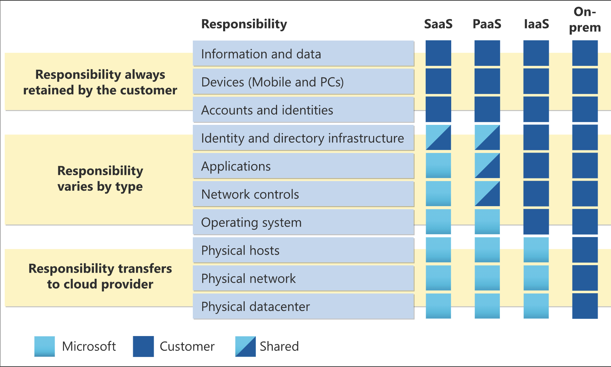

# Describe Cloud Concepts

## Describe cloud computing

1. Describe cloud concepts	                    25-30% 
2. Describe Azure architecture and services	35-40%
3. Describe Azure management and governance	30-35%

### What is cloud computing

Cloud computing is the delivery of computing services over the internet.

### Describe the shared responsibility model

### Define cloud models

1. Public
   It’s a cloud (delivering IT services over the internet) that’s used by a single entity
2. 
    A public cloud is built, controlled, and maintained by a third-party cloud provider. With a public cloud, anyone that wants to purchase cloud services can access and use resources

3. Hybrid cloud
     A hybrid cloud environment can be used to allow a private cloud to surge for increased, temporary demand by deploying public cloud resources.

4. Multi-cloud
    you use multiple public cloud providers. Maybe you use different features from different cloud providers

5. Azure Arc
    Azure Arc can help manage your cloud environment,

6. Azure VMware Solution

lets you run your VMware workloads in Azure with seamless integration and scalability

### Consumption based model

1. Capital Expenditure
    one time initial cost.
2. Operational Expenditure
    pay as you go.

Cloud is the consumption based model.

## Describe the benefits of using cloud service
1. High Availability
2. Scalability
3. Reliability
    recover from failure
4. Predictibility
    predict cost and performance
5. Performance
    Autoscale, load balance
6. Cost

### Describe the benefits of security and governance in the cloud
handles regulatory and governance.
handles Denial of Service (DDos)

## Describe the benefits of manageability
1. Management of the cloud
    1. autoscale
    2. deploy resources based on template
    3. monitoring
    4. alerts

2. Management in the cloud
    1. through the web portal
    2. using CLI
    3. using APIs
    4. Using powershell
    

## Describe cloud service types

1. IaaS
    Renting a hardware. 
    Manage by customer

    E.g 
        1. EC2

    Scenarios
        1. lift and shift migration. 
            migrate from on premisis data center of IaaS.
        2. Testing and Developement

2. PaaS
    Rent a space in a datacenter. develop and deploy. E.g Virtual Machine   
    E.g 
        1. Database, Container, Container Orchestration, Visualisation

3. SaaS
    Renting fully developed application e.g Email, Financial Software, messaging application

# Describe Azure architecture and Service

## Describe the core architecture components of Azure

### Describe Azure physical Infrastructure
1. Region
    geographical area that contains atleast one data centers

2. Availability zones
    physically seperate datacenters withtin Azure region.

#### Region Pairs
    pair service ot another region within same geography.
#### Sovereign Region
    Isolated from main instance of azure. compliance or legal purpose.

### Azure Management infrastructure

#### Azure resource and resource groups

Resource: VM, virtual network, database

#### Azure subscriptions
    Unit of management, billing and scale.

Azure subscription.
Azure management group

### Task 1: Create a virtual machine
In this task, you’ll create a virtual machine using the Azure portal.

Sign in to the Azure portal.

Select Create a resource > Compute > Virtual Machine > Create.

## Describe Azure compute and networking services

#### Azure Virtual Machine
create and maintain VMs in the cloud.
virtual machine schale sets allow you to create group of identical load-balanced VMs. good for autoscalling 

#### Azure containers
virtualised environment

#### Azure function
event driven, serverless compute.
stateless or durable.

#### Azure virtual network
virtual network and subnets enables azure resources to communicate with each other.
    1. Isolation and Segmentation
    allows to create multiple isolated virtual network with ip range which are not internet routable. 
    we can define subnets and allocate part of the 
    
     spaces.
    2. Internet communication
   enable incoming connection by assigning ip. 
   3. Communicate between azure resources.
   4. Communicate with on-premisis resources
   5. Route network traffic
   can define how traffic should be routed.
   6. Filter network on traffic
   7. Connect virtual networks

#### Virtual private network

uses encryption tunner within another network.
1. Policy based
statically specify ip address of the packet that should be encrypted.
2. Route based gateway
static route or dynamic route decide which packets to encrypt.

#### Azure ExpressRoute
lets you extend your on-premisis network into MS cloud over a private connection.

#### Azure DNS
DNS hosting service

### Azure Storage Service

#### Azure Storage Account
It provides namespace for your azure storage

#### Redundancy in primary region
always replicates three times in primary region.

1. Locally Redundant storage
11 nines of durability. Lowest code. server rack or drive failure support.

2. Zone redundant storage
12 nines. synchronously 

#### Redundancy in secondary region region
1. Geo redundant storage
3 times synchronously in single physical location in primary. 1 time asynchronously in the secondary region.
16 nines.
2. Geo zone redundant storage
primary similar to geo redundant + secondary like LRS

### Azure storage service
1. Azure Blobs
    Text and Binary
    Access Tiers
    1. Hot access tier. use for frequently accessed data.
    2. cool access tier. infrequent access and stored for 30 days.
    3. cold access tier. infrequent and stored atleast 90 days.
    4. Archive access tier. rarely accessed. keept for 180 days.

2. Azure file
    File shares
3. Azure Queue
4. Azure Disk
    hard drive
5. Azure Tables
    NoSQL table 

### Identify Azure data migration options

#### Azure directory service

sign in and access both microsoft cloud application and cloud application.

##### Who uses AD
1. IT administrators
2. App developers
3. Users
4. Online service subscribers

##### What does Azure AD do?
1. Authentication
2. Single sign on
3. Application management
4. Device management

##### What is Azure Active Dictory Domain Services?
managed domain service.

##### How does Azure AD DS Work?
you define a unique namespace. Two window server domain controller are deployed into selected Azure region.

##### Is Information synchronised?
they are not synchronised.

### Describe Azure authentication methods
1. Single Signon
2. multifactor authentication
3. Passwordless
    Setup on the device.
    1. Windows Hello for Business
        designated windows pc.
    2. Microsoft authenticator app
    3. FIDO2  security keys(Fast IDentity Online)
        USB device, Bluetooth, NFC

### Describe Azure external Identities
1. Business to business collaboration
    using their preferred identity to sign on.
2. B2b direct connect - mututal, tow way truth with another Azure AD organisation.
3. Azure AD business to Customer(B2C) - 
    use Azure Ad B2C for identity and access management

### Conditional Access
    allows to access resource based upon identity signal.

    Use in following conditions
    1. Request MFA
    2. Required acess to service only through approved client app.
    3. Required access to service only from managed service.
    4. Block access from unrusted sources.

### Azure role based access
scopes include
1. managment group
2. single subscription
3. resource group
4. single resource

### Zero Trust model
authenticate everyone even when in the same network.

1. verify explicitly
2. use least privilege access
3. Assume breach

### Defense indepth
1. Physical
2. Identity and Access
3. Perimeter. DOS
4. Network
5. Compute
6. Application
7. Data

### Defender for Cloud
monitoring tool for security and threat protection.

#### Azure Native protections
1. Azure PaaS services.
    detect threats for services like Azure App Service, SQL, Storage,
2. Azure Data services 
     defender for SQL, Storage.
3. Network 
    defender for limit brute force attack

#### Defend resources running on other clouds
AWS services, container, Ec2 instances

#### Assess, Secure and Defend
1. Assess
    Continiously assess. identify and track vulnerabilities
2. Secure
    Harden resources and services, workloads
3. Defend
    detect and resolev threats to resources, services, workloads

# Describe Azure management and Governance

## Describe cost management in Azure

### Describe factors that can affect costs in Azure
1. Resource Type
2. consumption
3. maintaince
4. geography
5. subscription type
6. Azure marketplace

### Compare the pricing and total cost ownership calculators

with the pricing calculator, you can estimate the cost of any provisioned resources, including compute, storage and associated network costs

#### TCO calculator
compare cost of Azure Cloud infrastructure vs on-premises.

Price calculator: https://azure.microsoft.com/en-us/pricing/calculator/

#### Azure cost management tool
quickly check cost, create alerts based on resource spend.
1. Cost alert
 show all the alerts
2. Budget alerts
    exceeds defined amount.
3. credit alerts
    Azure credit monetary commitments are consumed.
4. departmenet spending quota alert
    when department exceeds the threshold.
5. budget
    where you set a spending limit.

#### Purpose of tags
A way to organise resource.
1. Resource Management
    Look for associated resources.
2. cost management and optimisation
    since tag enable to group tag hence can be useful to create reports.
3. operational management
    SLA uptime or performance gaurentee.
4. security
    classify the resource by tag. public or private.
5. governance and regulator
    tags can be part of the standard.
6. workload optimisation and automation
    visualize all the resource involved in the complex deployment.

### Describe features and tools in Azure for governance and compliance

#### Purpose of Azure Blueprints
lets you standardize cloud subscription or environment deployments.

##### What are the artifacts
each component in the bllueprints definition.
It can contain 0 or more paramters

#### Purpose of azure policy
lets you create, assign and manage policies that control or audit resource.
individual or group related policies.

##### Azure policy initiative
grouping realated policies to track you compliance state of larger goal.

1. Monitoring unencrypted SQL Database in Security Center
    monitor for unencrypted SQL Server.
2. Monitor OS vulnerabilities in Security Center
    monitor servers that dont satisfy configured OS vulnerability baseline
3. Moniting missing endpoint in protection in security center
    monitor server that dont have have endpoint installed.

#### Purpose of resource locks
Prevents resources from being accidentaly deleted or chanaged.

#### Purpose of the Service Trust Portal
portal that provides access to various content, tools and other resources about
microsoft security, privacy and compliance practice.

## Describe features and tools for managing and deploying Azure resources

### Describe tools for interacting with Azure
1. Azure portal
2. Azure cloud shell
    brower based shell to to use powershell and cli.
3. Azure powershell
4. Azure cli

### Purpose of Azure Arc
lets  you extend your azure compliance and monitoring to your hybrid and multicloud configuration.

#### What can Azure Arc do outside Azure?
Manage following resources
1. Servers
2. Kubernetes clustures
3. Azure data services
4. SQL Server
5. Virtual machines(preview)

### Azure Resource Manager and Azure ARM templates
deployment and management service for Azure.
management layer that enabled you to create, update and delete resources in your Azure account.

#### ARM template 
infrastructure as a code. JSON format.

Benefits
1. Declarative syntax
2. Repeatable results
3. Orchestration
4. Modular files
5. Extensibility

## Describe Monitoring Tool in Azure

### Prupose of Azure Advisor
evaluates azure resource and makes recommendations to help improve reliability, security and performance, achieve operational excellance and reduce cost.
can recommend on subscription, resource group or services.

categories of recommendation.
1. Reliability
2. security
3. performance
4. operational excellence
5. cost

### Azure Service Health
knowing the status of the global Azure infrastructure and your individual resources.

Uses following services
1. Azure status
    informs about service outrages.
2. service health
    service and region
3. Resource health
    health of the individual cloud resource.

### Azure monitor
a platform for collecting data on your resources, analysing that data, visualising the info and acting on the results.

#### Azure log analytics
write and run log queries gathered by azure.

#### Azure Monitor Alerts
detect when thresold being crossed.

#### Application insights
sdk or application insights agent.

1. request rate, response time, failure rates
2. page view and load performace
