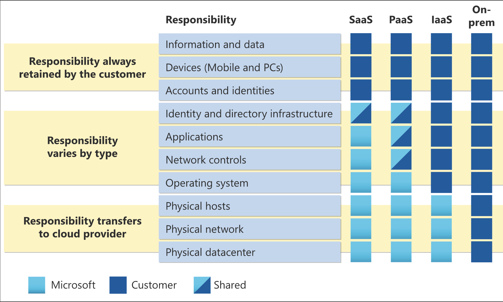

# Describe Cloud Concepts

## Describe cloud computing

1. Describe cloud concepts	                    25-30% 
2. Describe Azure architecture and services	35-40%
3. Describe Azure management and governance	30-35%

### What is cloud computing

Cloud computing is the delivery of computing services over the internet.

### Describe the shared responsibility model

### Define cloud models

1. Public
   It’s a cloud (delivering IT services over the internet) that’s used by a single entity
2. 
    A public cloud is built, controlled, and maintained by a third-party cloud provider. With a public cloud, anyone that wants to purchase cloud services can access and use resources

3. Hybrid cloud
     A hybrid cloud environment can be used to allow a private cloud to surge for increased, temporary demand by deploying public cloud resources.

4. Multi-cloud
    you use multiple public cloud providers. Maybe you use different features from different cloud providers

5. Azure Arc
    Azure Arc can help manage your cloud environment,

6. Azure VMware Solution

lets you run your VMware workloads in Azure with seamless integration and scalability

### Consumption based model

1. Capital Expenditure
    one time initial cost.
2. Operational Expenditure
    pay as you go.

Cloud is the consumption based model.

## Describe the benefits of using cloud service
1. High Availability
2. Scalability
3. Reliability
    recover from failure
4. Predictibility
    predict cost and performance
5. Performance
    Autoscale, load balance
6. Cost

### Describe the benefits of security and governance in the cloud
handles regulatory and governance.
handles Denial of Service (DDos)

## Describe the benefits of manageability
1. Management of the cloud
    1. autoscale
    2. deploy resources based on template
    3. monitoring
    4. alerts

2. Management in the cloud
    1. through the web portal
    2. using CLI
    3. using APIs
    4. Using powershell
    

## Describe cloud service types

1. IaaS
    Renting a hardware. 
    Manage by customer

    E.g 
        1. EC2

    Scenarios
        1. lift and shift migration. 
            migrate from on premisis data center of IaaS.
        2. Testing and Developement

2. PaaS
    Rent a space in a datacenter. develop and deploy. E.g Virtual Machine   
    E.g 
        1. Database, Container, Container Orchestration, Visualisation

3. SaaS
    Renting fully developed application e.g Email, Financial Software, messaging application

# Describe Azure architecture and Service

## Describe the core architecture components of Azure

### Describe Azure physical Infrastructure
1. Region
    geographical area that contains atleast one data centers

2. Availability zones
    physically seperate datacenters withtin Azure region.

#### Region Pairs
    pair service ot another region within same geography.
#### Sovereign Region
    Isolated from main instance of azure. compliance or legal purpose.

### Azure Management infrastructure

#### Azure resource and resource groups

Resource: VM, virtual network, database

#### Azure subscriptions
    Unit of management, billing and scale.

Azure subscription.
Azure management group